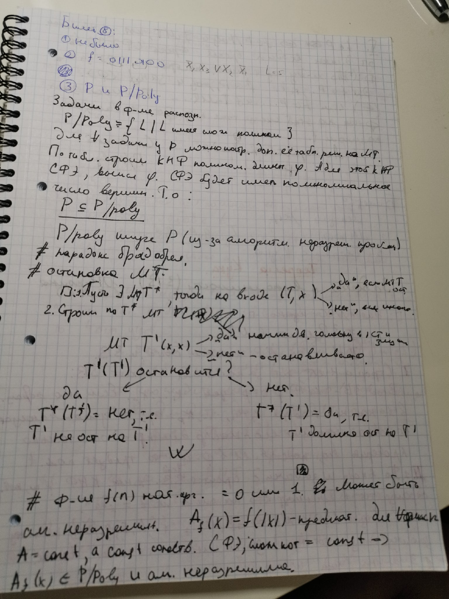

# Подготовка к предзащите МЛиТА

```
За вопросы и некоторые ответы к ним благодарность потоку ИУ8 2018г.
```

## Содержание:

### ✔️ [1. Как доказать общезначимость формулы без кванторов?](#click_1)
### ✔️ [2. Как переформулировать задачу в оптимизационной форме в задачу в форме распознавания?](#click_2)
### ✔️ [3. Как доказать строгое включение класса __P__ в __P/poly__?](#click_3)
### ✔️ [4. Исследовать на выполнимость: `∀xA(x) -> (Ex ¬ C(x) -> Ex не (A(x) -> C(x)))`.](#click_4)
### ✔️ [5. `∀x∃y A` общезначима?](#click_5)
### ✔️ [6. Можно ли заменить в теореме Кука КНФ-выполнимость на тождественную ложь?](#click_6)
### ✔️ [7. Определение сложности в худшем случае для НМТ и ОМТ.](#click_7)
### ✔️ [8. Привести пример алгоритмически неразрешимых задач.](#click_8)
### ✔️ [9. Теорема о соотношении МТ и НАМ.](#click_9)
### ✔️ [10. Можно ли дать определение оракульной машины Тьюринга используя язык предикатов?](#click_10)
### ✔️ [11. Как связана сложность МТ и количество команд в ней?](#click_11)
### ❌    [12. Пример сводимости по Тьюрингу.](#click_12)
### ❌    [13. Почему `PSPACE` лежит в `EXPTIME`?](#click_13)
### ✔️ [14. Всегда ли в базисе `{∧, ∨, ¬}` наименьшая сложность СФЭ для функции f - это функция, реализующаяся её минимальной ДНФ?](#click_14)
### ✔️ [15. Дать определение класса `P/Poly` при помощи исчисления предикатов? (Определить понятие `P/Poly` с использованием языка предикатов?)](#click_15)
### ❌    [16. Привести пример алгоритмически неразрешимой проблемы с доказательством.](#click_16)
### ❌    [17. Вопрос на исследование формулы.](#click_17)
### ✔    [18. Теорема Ланднера.](#click_18)
### ❌   [19. Мини-вопрос: Может ли `Co-NP` лежать в `NP` (да может, есть пересечение: класс `P`)?](#click_19)
    

### 1. Как доказать общезначимость формулы без кванторов? <a name="click_1"></a> 
#### Ответ:
1) *Опр.:* Формула логики предикатов наз. **логически общезначимой**, если она истинна в любой интерпретации.
(Простым языком: Логическая общезначимость формулы означает, что какую бы ни выбирали область интерпретации и какие бы соответствия не задавали, мы всегда будем получать истинные отношения или высказывания)

2) Построим таблицу, в которой A и B - предикаты, F - конечная данная формула. Предполагаем, что в какой-то интерпретации каждая из формул A и B - истинна или ложна. Если конечная формула F - истинна при любых входях подформулах, то F - общезначима.

### 2. Как переформулировать задачу в оптимизационной форме в задачу в форме распознавания? (Можно ли переформировать задачу в форме оптимизации в форму распознавания, и значит ли это что NP трудная задача переформулируется в NP полную?) (Как переформулировать задачу из формы оптимизации в форму распознавания? Следует ли из этого, что np-hard в форме оптимизации всегда можно переформулировать в npc в форме распознавания?) <a name="click_2"></a> 
(Я привёл пример задачи комивояжера в двух формах (он принял), а про второй вопрос он сказал, что я ответил не на тот)
#### Ответ:
На счёт оптимизации можно поставить какие-нибудь пороги
типа если у тебя оптимизация перехходит порог - то есть, если не переходит, то нет
грубо говоря, нужно проверить 
есть ли а графе ГЦ
А у тебя задача по оптимизации: цикл опр длины
порогом будет - число вершин
попробуй так
Если непонятно - могу другими словами попытаться
А нельзя просто поменять вопрос «какой?» на «существует ли?»

### 3. Как доказать строгое включение класса __P__ в __P/poly__? <a name="click_3"></a> 

Почему вообще  __P__ включается в __P/poly__:



(тема алгоритмически неразрешим задач)
#### Ответ: сказать о существовании алгоритмически неразрешимых задач.
В вопросе про строгое включение P в P/Poly он в основном говорит об алгоритмически неразрешимых задачах и их отношению к P/ Poly
Он хотел бы услышать про функцию натурального аргумента... (см. Стр 80 старого конспекта)
Про общезначимость вариант навесить кванторы всеобщности - неправильно. 
Про определение ОМТ через предикаты, он отметил минимальную логику в том, чтобы представить функцию предикатом и использование кванторов всеобщеости и существования
Правильных ответов он не дал специально, по его словам

P/poly-мн-во предикатов таких, что набор функций, получаемые от этих предикатов, реализуются за полиномиальные схемы от n, где n-количество переменных в функции
P/poly - A(x1,x2...): f1(x1),f2(x1,x2) и тд реализуются за P(n), где A-предикаты
видимо как-то так
P(n)-полином

### 4. Исследовать на выполнимость: `∀xA(x) -> (Ex NOT C(x) -> Ex не (A(x) -> C(x)))`. <a name="click_4"></a> 

#### Ответ: не общезначима
UPD: кирпич сломался, формула общезначима и это доказано на семинаре
Определение сложности в худшем случае для НМТ и ОМТ

### 5. `∀x∃y A` общезначима? <a name="click_5"></a> 
Ex∀y A не выполнима
Существует ли формула А для которой вот это верно?

#### Ответ: да, существует. `x~y`(на булевых, к примеру и тд)/ `x==y` (более общий, вроде бы)/(или подобные).

### 6. Можно ли заменить в теореме Кука КНФ-выполнимость на тождественную ложь? <a name="click_6"></a> 

#### Ответ: Теорема 9.2. 
Если NP=Co-NP, то можно, тк первый пункт теоремы Кука - доказать, что задача принадлежит NP. Данная задача(с тождественной ложью) принадлежит coNp, отсюда и ответ, полученный выше.

### 7. Определение сложности в худшем случае для НМТ и ОМТ. <a name="click_7"></a> 

#### Ответ: Дается через общее определение сложности в худшем, накладывается на определения сложностей НМТ, ОМТ. В нмт - минимум по всез отгадам по данному условию. ОМТ - аналогично МТ, тк к оракулу за такт обращаемся

### 8. Привести пример Алгоритмически неразрешимых задач. <a name="click_8"></a> 

#### Ответ: 
1. Задача о Брадобрее. Брадобрей бреет тех, кто не бреет сам себя. Бреет ли сам себя брадобрей?
2. Задача об остановке Машины Тьюринга.


### 9. Теорема о соотношении МТ и НАМ. <a name="click_9"></a>

#### _Теорема_:

**Пусть T – МТ с алфавитом A и расширенным алфавитом C из A. 
Существует НАМ J над C вполне эквивалентный (т.е. на разных входных словах дают один правильный результат) алгоритму для МТ.**


### 10. Можно ли дать определение оракульной машины Тьюринга используя язык предикатов? <a name="click_10"></a> 

#### Ответ: Да, можно.

По сути, мы подаём на НМТ некий вход, условия, далее ОМТ что-то делает и даёт на выходе ответ. Рассуждения далее только для задач в форме распознования, где возможен бинарный ответ. Пусть есть n+1 местный предикат, где n -длина входа, условия. На вход этого предиката подаётся оракульная функция, а также вход(в качестве n как раз термов).Далее предикат выдаёт 1, если ответ "да", и 0, если ответ "нет". Это учитывает возможность многократного вызова оракула. Внутри предиката как-то проверяется вход, обрабатывается, в том числе с вызовом оракула произвольное количество раз(в него можем подавать любой кусок входа, или весь вход). (если он скажет, что память должна быть динамической, то омт - это множестов предикатов, с одинаковыми свойствами, просто отличающиеся длинной входа)

Вариант 2: логика та же, только преликат 2местный, и один вход - оракульная функция, другой - вход, условие задачи.

### 11. Как связана сложность МТ и количество команд в ней? <a name="click_11"></a> 

#### Ответ: Никак, так как сложность МТ это количество тактов ее работы, которое не связано с множеством команд.

### 12. Пример сводимости по Тьюрингу. <a name="click_12"></a> 

#### Ответ:

### 13. Почему `PSPACE` лежит в `EXPTIME`? <a name="click_13"></a> 

#### Ответ:

### 14. Всегда ли в базисе `{∧, ∨, ¬}` наименьшая сложность СФЭ для функции f - это функция, реализующаяся её минимальной ДНФ? <a name="click_14"></a> 

#### Ответ: Точно нет. доказательство - примером. функция: НЕ(xy). сложность - 2 её мин днф: НЕ(х)/НЕ(у), сложность - 3. 
* Нет, так как можно использовать КНФ. Зависит от количества 0 и 1 в таблице.

### 15. Дать определение класса `P/Poly` при помощи исчисления предикатов? (Определить понятие `P/Poly` с использованием языка предикатов?) <a name="click_15"></a> 

#### Ответ: 

1) *Определение:* **P/poly** - множество предикатов таких, что набор функций, получаемые от этих предикатов, реализуется за полиномиальные схемы от n, где n - количество переменных в функции.
2) *Определение:* **P/poly** - множество предикатов вида P, таких, что функции f1, f2,..., fn,... реализуют СФЭ полиномиальной сложности по n. (Существует P - предикат, который определен на множестве всех двоичных последовательностей длины от 1 до бесконечности f1(x1)=P1, f2(x1,x2)=P2, ... fn(x1, ..., xn)=Pn,  Pn - это функция он n переменных.)
3) *Определение:* **P/poly** - A(x1,x2...): f1(x1),f2(x1,x2) и тд реализуются за P(n), где A-предикаты, P(n)-полином
4) *Определение (из введений Гордеева):* Класс булевых функций, для которых существуют схемы полиномиальной сложности обозначим через **P/poly**.

Из лекции:


### 16. Привести пример алгоритмически неразрешимой проблемы с доказательством. <a name="click_16"></a> 

#### Ответ:

Теорема. Проблема остановки алгоритмически неразрешима. Доказательство. От противного. Пусть такая машина T* существует. Тогда на входе (T,x) она выдает ответ «да», если машина Т останавливается на этом входе, и «нет» в противном случае. (Здесь Т – слово в алфавите А, являющееся описанием машины Т). Тогда по Т* можно построить машину Тьюринга T’(x), которая в случае, если T*(x,x)=”да”, начинает двигать головку в одну сторону и зацикливается, а в случае T*(x,x)=”нет” она останавливается. Что в этом случае будет означать T’(T’)? Остановится или нет машина на этом входе? Если «да», то это означает, что T*(T’)= «нет», т.е. T’ не должна останавливаться на T’. Если «нет», то это означает, что T*(T’)= «да», т.е. T’ должна останавливаться на T’. Получили противоречие Теорема доказана.

Рассмотрим функцию натурального аргумента f(n), принимающую значения 0 или 1. Можно показать, что вычисление такой функции может быть алгоритмически неразрешимой проблемой, т.е. не входит такая задача ни в какой класс сложности, а не только в класс P. Рассмотрим теперь предикат Af(x)=f(|x|). Для любого фиксированного n предикат равен константе. А константе сопоставляется СФЭ, сложность которой тоже равна константе. Поэтому Af(x) P/poly, но его вычисление может быть алгоритмически неразрешимой проблемой.

### 17. Вопрос на исследование формулы. <a name="click_17"></a> 

#### Ответ:

### 18. Теорема Ланднера. <a name="click_18"></a> 

> (Её смысл - то, что класс NP неоднороден. Т.е. если P не равно NP, то разбить NP можно минимум на 3 класса: NPC, P и вот этот класс по середине, существование которого доказывается в этой теореме. Т.е. если есть задача из NP, и она не в NPC и не в P, то это не всегда значит, что просто не смогли доказать один из 2 фактов, возможно, она в 3 классе) Только классов не три, а больше, ибо серединка эта неоднородна.

 **_Теорема_**

 **Пусть B – неоднородный рекурсивный язык, такой, что B ∉ P (т.е. слова этого языка не распознаются за полиномиальное время на МТ). Тогда ∃ язык D ∈ P, распознаваемый за полиномиальное время: A = D ∩ B, A ∉ P.
 При этом A ∝ B ∝ A.**

(Без доказательства)

#### Ответ:

Эта теорема имеет практическое применение, если PNP. Пусть B – задача «Гамильтонов цикл», тогда теорема утверждает, что найдется такой класс распознаваемых за полиномиальное время графов, что на этом классе графов задача «Гамильтонов цикл», не имея полиномильного алгоритма решения, в то же время не является NP-полной.

Если P!=NP, то теорема утверждает непустоту NPI класса и дает представление о его структуре. Он состоит из бесконечной совокупности классов эквивалентности языков, каждый из которых «чуть-чуть» сложнее другого. Кроме того в нем есть пары языков, ни один из которых полиномиально не сводится к другому!

это про Т. Ланднера из конспекта:


### 19. Мини-вопрос: Может ли `Co-NP` лежать в `NP` (да может, есть пересечение: класс `P`). <a name="click_19"></a> 

#### Ответ:
